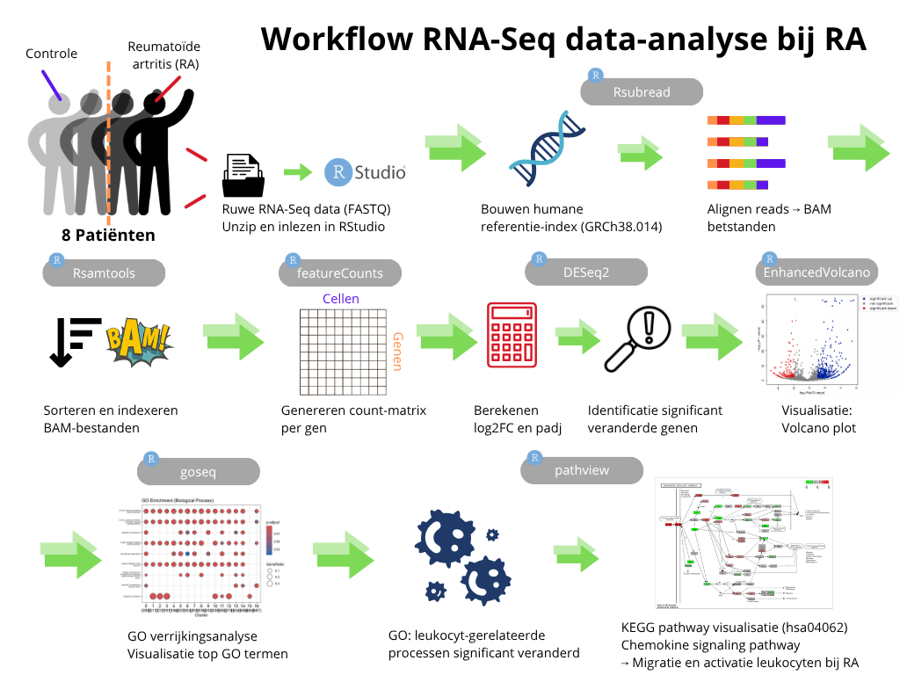

# Transcriptomics Casus
____
## 🧾 Inleiding 

Reumatoïde artritis (RA) is een chronische auto-immuunziekte waarbij het afweersysteem het eigen lichaam aanvalt, vooral het slijmvlies van gewrichten. Dit zorgt voor ontstekingen die uiteindelijk schade aan de gewrichten kunnen veroorzaken (Smolen et al., 2016). Er is bekend dat factoren zoals erfelijkheid en roken een rol zouden kunnen spelen bij het ontstaan van RA (Firestein & McInnes, 2017). Ook zijn er antistoffen in het bloed, zoals anti-CCP, die helpen bij het stellen van een diagnose (van der Helm-van Mil et al., 2025). Maar ondanks al die kennis blijft het onduidelijk wat er precies op moleculair niveau gebeurt in het slijmvlies weefsel bij RA.

Om daar meer inzicht in te krijgen, wordt er tegenwoordig gebruikgemaakt van RNA-sequencing (RNA-seq). Hiermee kun je precies zien welke genen actief zijn in cellen van RA-patiënten, en hoe dat verschilt van gezonde mensen. Dat zou dus meer informatie geven over welke genen en signaalroutes mogelijk betrokken zijn bij RA (Guo et al., 2023). In dit onderzoek worden daarom RNA-seq-gegevens van synoviumbiopten van RA-patiënten en gezonde mensen vergeleken, om te ontdekken welke biologische processen hierbij mogelijk een rol spelen.

#### Hoofdvraag

In welke biologische processen verschilt de genexpressie van patiënten met RA ten op zichte van de genexpressie van gezonde controles?

**Deelvragen**
- Welke genen komen significant verschillend tot expressie bij RA-patiënten vergeleken met gezonde controles?
- Welke biologische processen zijn verrijkt bij de genen die differentieel tot expressie zijn gebracht?
- Welke genen binnen de chemokine signaling pathway zijn veranderd bij RA, en wat is de rol van deze signaalroute in leukocytenactivatie?

___
## 🧪 Methode

Voor dit onderzoek werd een RNA-sequencinganalyse uitgevoerd met monsters afkomstig van acht patiënten, vier hiervan met reumatoïde artritis (RA) (diagnoseduur > 12 maanden, anti-CCP-positief) en vier patiënten dienden als controlegroep zonder RA (anti-CCP-negatief). 

De ruwe data werd gedownload en ge-unzipt, vervolgens werd in RStudio gebruik gemaakt van de [`Rsubread`](./scripts/Rsubread.R) (Liao et al., 2019; versie 2.22.1) package om de referentie-index van het humane genoom (GRCh38.p14) (Homo Sapiens Genome Assembly GRCh38.p14, z.d.) op te bouwen en de reads te alignen naar het genoom. De uitgelijnde BAM-bestanden werden gesorteerd en geïndexeerd met [`Rsamtools`](./scripts/Rsamtools.R) (Morgan et al., 2025; versie 2.24.0).

Met featureCounts werden de read counts per gen bepaald en hieruit volgde een count-matrix. Omdat dit nog een subset was, werd er vanaf nu gewerkt met de (aangereikte) volledige count-matrix. Er werd een differentiale genexpressieanalyse (DGE) uitgevoerd met de package [`DESeq2`](./scripts/deseq.R) (Love et al., 2014; versie 1.48.1). 

Hierbij werd onder andere de log2-fold change (log2FC) en de adjusted p-value (padj) berekend, om de genen met significante expressieveranderingen tussen RA en de controlegroep eruit te halen. Resultaten werden weergegeven in o.a. een volcano plot (via [`EnhancedVolcanoplot`](./scripts/EnhancedVolcano.R)) (Blighe et al., 2025; versie 1.26.0).

Vervolgens werd een Gene Ontology (GO) verrijkingsanalyse uitgevoerd met [`goseq`](./scripts/goseq.R) (Young et al., 2010; versie 1.60.0) en visualisatie met ggplot2. Hiervoor werden eerst de genen die differentieel tot expressie waren gekomen gefilterd met, log2FC > 1 en padj < 0.05.  Daarna werd een KEGG-pathway onderzocht (op basis van de resultaten van de GO-analyse) met behulp van [`pathview`](./scripts/pathview.R) (Luo et al., 2013; versie 1.48.0), er werd gekozen voor pathway 'hsa04062', de pathway voor Chemokine signaling. Chemokines spelen een grote rol in het aantrekken van immuuncellen naar ontstekingsweefsel en bij RA is er chronische ontsteking van het synovium en daar zijn chemokines heel actief. Daarnaast reguleert deze pathway de migratie en activering van leukocyten (witte bloedcellen), deze leukocyt-gerelateerde processen kwamen ook naar voren in de [`GO-analyse`](./resultaten/GO-analyse.png) (400 counts, 32,8% hits en p-value = 3,847567e-22).

Scripts en data zijn te vinden in de mappen [`scripts`](./scripts) en [`data`](./data), het volledige script is [`Rscript`](./scripts/Rscript.R). De methoden zijn ook uitgewerkt in de workflow die hieronder staat, zie figuur 1.

  

*Figuur 1: workflow van de RNA-Seq data-analyse bij reumatoïde artitis (RA), boven de stappen staat de package die is gebruikt voor het uitvoeren van deze stap*
___
## 📊 Resultaten

### Genen die significant veranderd zijn bij RA-patiënten

Om de verschillen in genexpressie te vinden tussen patiënten met reumatoïde artritis (RA) en gezonde controles, is een differentiële genexpressie-analyse uitgevoerd. In de [`volcano plot`](./resultaten/EnhancedVolcanoPlot.png) (zie figuur 2) zijn de genen te zien die significant verschillend tot expressie komen. De genen in het rood hebben zowel een statistische significante p-waarde als een hoge log₂ fold change, met deze genen wordt dan ook verder gewerkt in de analyse.

  

*Figuur 2: volcano plot van differentiële genexpressie tussen RA-patiënten en controles. De figuur toont de genen die significant veranderd tot expressie komen tussen RA-patiënten en gezonde controles. Log₂ fold change tegenover -log10 p-waarde. Rood is zowel statistisch significant als een hoge log₂ fold change.*

### Immuungerelateerde processen verrijkt bij RA

Hierna werd een [`GO (Gene Ontology) analyse`](./resultaten/GO-analyse.png) uitgevoerd (zie figuur 3) en hieruit kwam dat immuungerelateerde processen meer betrokken zijn bij patiënten met RA. Dit sluit aan bij RA als een auto-immuunziekte, waarbij dus de immuunactivatie een grote rol speelt. Zo is ook te zien dat "leukocyte activation" in de GO-analyse naar voren komt  met 400 counts, 32,8% hits en een p-value = 3,847567e-22. Met dit proces is verder gezocht naar pathways voor de KEGG-pathway analyse.

  

*Figuur 3: GO-verrijkingsanalyse van genen die differentieel tot expressie komen tussen RA-patiënten en controles. De figuur laat de top verrijkte GO-termen (biologische processen) zien, gebaseerd op de genen die differentieel tot expressie komen. De grootte van de stippen geeft het aantal genen (counts) weer, de kleur geeft de bijbehorende p-waarde (hoe donkerder, hoe meer significant). Op de X-as staat percentage genen die een hit zijn op de desbetreffende GO-term.*

### Activatie van de chemokine signaling pathway bij RA

Voor deze KEGG-pathway analyse werd de [`chemokine signaling pathway`](./resultaten/hsa04062.pathview.png) geanalyseerd, zie ook figuur 4. Binnen deze pathway is te zien dat er meerdere genen differentieel gereguleerd zijn tussen RA-patiënten en gezonde individuen. Onder andere PI3K, PLC, Rac en PKC betrokken bij processen als leukocytenmigratie, ontsteking en celactivatie. De rode kleur staat voor upregulatie, wat betekent dat het gen meer tot expressie is gekomen in de RA-patiënten dan in gezonde patiënten (Een Log₂FC = +5 betekent ongeveer 32x meer tot expressie). Groen staat juist voor downregulatie, waarbij het gen minder tot expressie is gekomen in RA-patiënten dan in de controles (Een Log₂FC = -5 betekent ongeveer 32x minder tot expressie). De activatie van deze route laat de rol zien van chemokines in het immuunantwoord bij RA. 

  

*Figuur 4: KEGG-pathway visualisatie van de chemokine signaling pathway ("hsa04062") bij RA-patiënten. Rood geeft upregulatie (hogere expressie in RA ten opzichte van controles), groen geeft downregulatie aan. Voorbeeld: een Log₂FC van +5 betekent circa 32 keer hogere expressie. De activatie van deze pathway benadrukt de rol van chemokines in de migratie en activatie van leukocyten tijdens het immuunrespons bij RA.*

___
## 🎯 Conclusie

In dit onderzoek is gekeken naar de verschillen in genexpressie tussen RA-patiënten en gezonde controles. Het hoofddoel was om te achterhalen welke biologische processen betrokken zijn bij RA op basis van differentiële genexpressie.

Uit de analyse kwamen een aantal genen naar voren die significant verschillen in expressie bij RA-patiënten. Deze genen zijn geïdentificeerd via een differentiële genexpressieanalyse en weergegeven in een volcano plot. Op basis van deze genen werd vervolgens onderzocht welke biologische processen verrijkt zijn bij RA. De GO-analyse liet zien dat vooral immuungerelateerde processen, zoals leukocyt activatie, wel verrijkt zijn bij RA. Dit komt overeen met de rol die het immuunsysteem speelt bij deze ziekte, en laat dus zien dat immuuncellen betrokken zijn bij het ziekteproces van RA.

Uiteindelijk is specifiek gekeken naar de chemokine signaling pathway, deze is cruciaal voor de migratie en activatie van leukocyten. Hierin werden meerdere genen gevonden die een grote verandering hebben in expressie, waaronder PI3K, PLC en PKC. De activatie van deze pathway laat zien dat chemokines bijdragen aan de chronische ontsteking bij RA.

Naast de chemokine signaling pathway zouden ook andere immuunroutes, zoals T-cell receptor signaling of NF-kB routes, verder onderzocht kunnen worden. Dit zou kunnen helpen om de immuunactivatie bij RA in kaart te kunnen brengen. 

___
## 🗂️ Data Stewardship

- Zie [`data_stewardship`](./data_stewardship) voor uitleg over het beheren van data volgens de FAIR-principes.

___

*Gemaakt door Rika Ferwerda*
